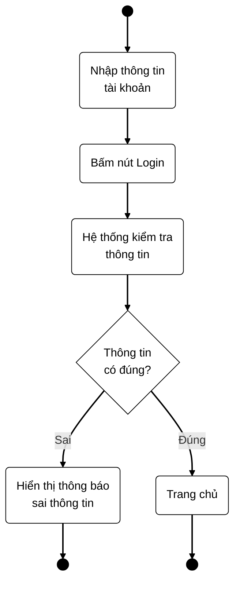

```mermaid
flowchart TD
    A(( )) --> B( Nhập thông tin<br/>tài khoản )
    B --> C( Bấm nút Login )
    C --> D( Hệ thống kiểm tra<br/>thông tin )
    D --> E{Thông tin<br/>có đúng?}

    E -- Sai --> H( Hiển thị thông báo<br/>sai thông tin )
    E -- Đúng --> F( Trang chủ )

    H --> I(( ))
    F --> G(( ))

    style A fill:#000,stroke:#000,color:#000
    style B fill:#fff,stroke:#000,color:#000
    style C fill:#fff,stroke:#000,color:#000
    style D fill:#fff,stroke:#000,color:#000
    style E fill:#fff,stroke:#000,color:#000
    style F fill:#fff,stroke:#000,color:#000
    style H fill:#fff,stroke:#000,color:#000

    style G fill:#000,stroke:#000,stroke-width:2px,color:#000
    style I fill:#000,stroke:#000,stroke-width:2px,color:#000

    linkStyle default stroke:#000,stroke-width:2px
```