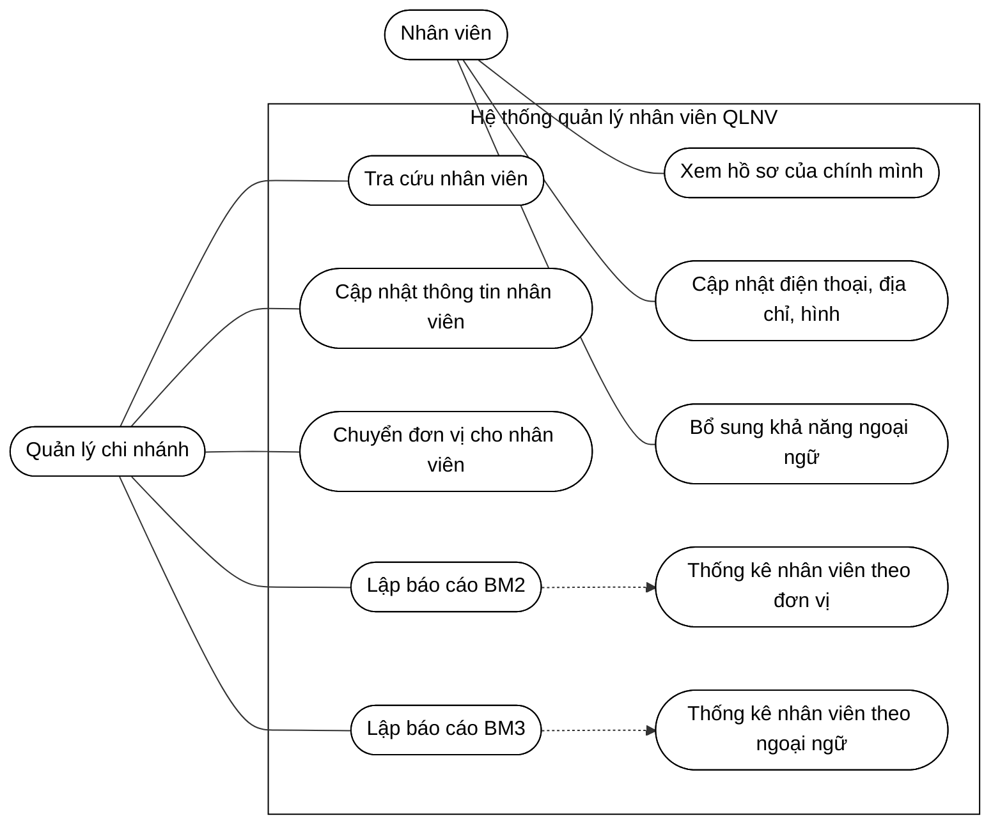

```mermaid
flowchart LR
    NV(["Nhân viên"])
    QL(["Quản lý chi nhánh"])

    subgraph HT["Hệ thống quản lý nhân viên QLNV"]
        UC1(["Xem hồ sơ của chính mình"])
        UC2(["Cập nhật điện thoại, địa chỉ, hình"])
        UC3(["Bổ sung khả năng ngoại ngữ"])
        UC4(["Tra cứu nhân viên"])
        UC5(["Cập nhật thông tin nhân viên"])
        UC6(["Chuyển đơn vị cho nhân viên"])
        UC7(["Lập báo cáo BM2"])
        UC8(["Lập báo cáo BM3"])
        UC9(["Thống kê nhân viên theo đơn vị"])
        UC10(["Thống kê nhân viên theo ngoại ngữ"])
    end

    NV --- UC1
    NV --- UC2
    NV --- UC3

    QL --- UC4
    QL --- UC5
    QL --- UC6
    QL --- UC7
    QL --- UC8

    UC7 -.-> UC9
    UC8 -.-> UC10

    style NV fill:#fff,stroke:#000,color:#000
    style QL fill:#fff,stroke:#000,color:#000

    style UC1 fill:#fff,stroke:#000,color:#000
    style UC2 fill:#fff,stroke:#000,color:#000
    style UC3 fill:#fff,stroke:#000,color:#000
    style UC4 fill:#fff,stroke:#000,color:#000
    style UC5 fill:#fff,stroke:#000,color:#000
    style UC6 fill:#fff,stroke:#000,color:#000
    style UC7 fill:#fff,stroke:#000,color:#000
    style UC8 fill:#fff,stroke:#000,color:#000
    style UC9 fill:#fff,stroke:#000,color:#000
    style UC10 fill:#fff,stroke:#000,color:#000

    style HT fill:#fff,stroke:#000,color:#000
```
